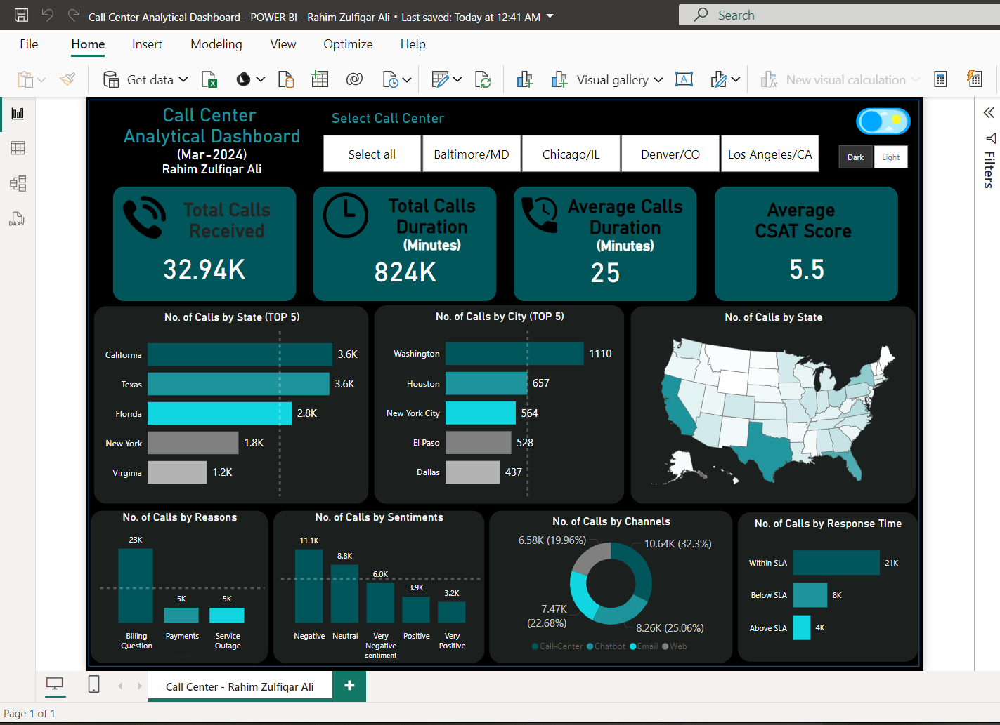
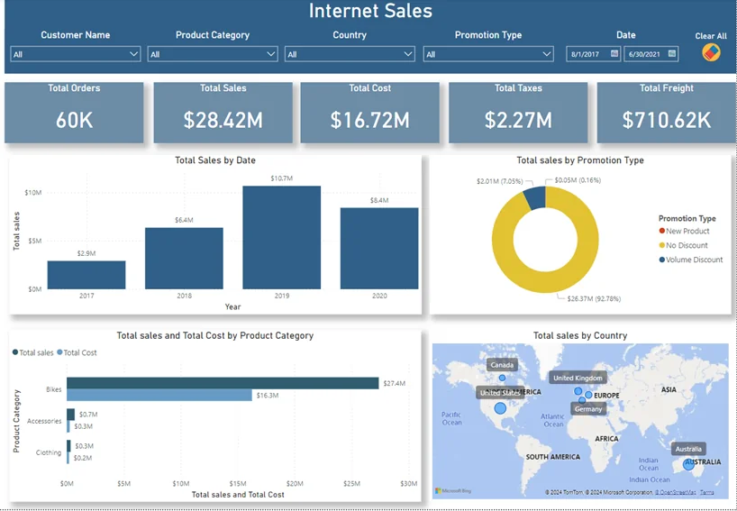
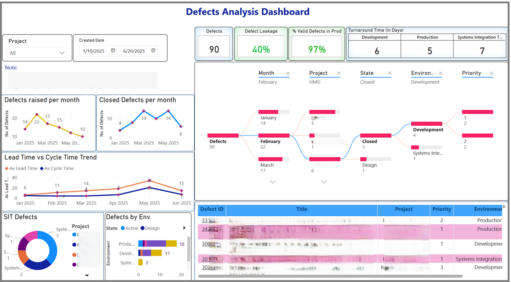
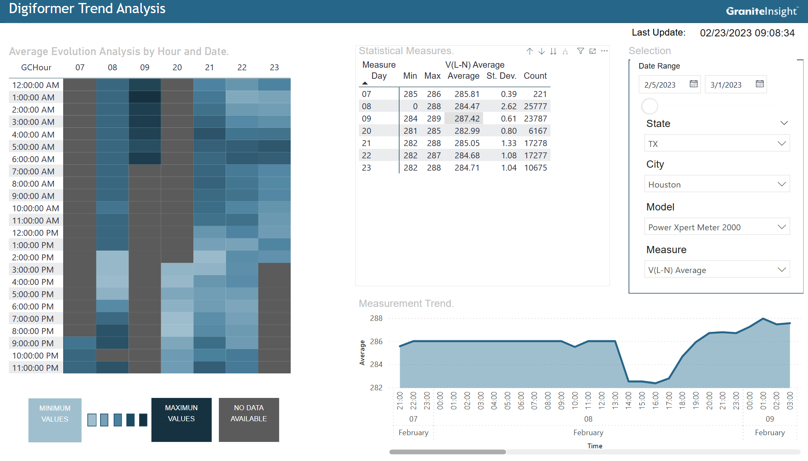

# PBI-Dashboard

# 📊 Power BI — Complete Business Intelligence Guide

<p align="center">
  
</p>

> A reference guide on Microsoft Power BI: what it is, why to use it, how it's deployed, and real dashboard examples.

---

## 📋 Table of Contents

- [What is Power BI?](#-what-is-power-bi)
- [Why use it?](#-why-use-it)
- [Use Cases](#-use-cases)
- [Enterprise Applications](#-enterprise-applications)
- [Data Types & Connectors](#-data-types--connectors)
- [Data Modeling & DAX](#-data-modeling--dax)
- [Deployment](#-deployment)
- [Dashboard Examples](#-dashboard-examples)
- [Learning Resources](#-learning-resources)

---

## 🔷 What is Power BI?

**Microsoft Power BI** is a Business Intelligence suite that allows you to connect data from multiple sources, transform it, model it, and present it through interactive visualizations and dynamic dashboards.

### Core Components

| Component | Description |
|---|---|
| **Power BI Desktop** | Desktop application for creating reports and data models |
| **Power BI Service** | Cloud platform (`app.powerbi.com`) for publishing, sharing, and collaborating |
| **Power BI Mobile** | Mobile app (iOS / Android) for consuming reports anywhere |
| **Power BI Report Builder** | For high-precision paginated reports |
| **Power BI Embedded** | For embedding visualizations into external applications |
| **Power BI Gateway** | For connecting on-premise data to the cloud service |

---

## ✅ Why use it?

### 🚀 Speed of Implementation
Allows you to build functional dashboards in hours, not months. Its drag-and-drop interface and pre-built connectors significantly reduce the learning curve.

### 💰 Cost-Effectiveness
With accessible licensing (from free version to Premium enterprise plans), Power BI delivers advanced capabilities at a fraction of the cost of its competitors.

### 🔗 Microsoft 365 Integration
If your organization already uses Excel, Teams, SharePoint, or Azure, integration is native and frictionless.

### 🧠 Built-in Artificial Intelligence
- **Q&A** — Natural language queries
- **Smart Narratives** — Auto-generated text describing your data
- **Anomaly Detection** — Automatic detection of anomalies in time series
- **Key Influencers** — Identification of factors impacting a metric

### Competitor Comparison

| Criteria | Power BI | Tableau | Qlik |
|---|:---:|:---:|:---:|
| Ease of use | ⭐⭐⭐⭐⭐ | ⭐⭐⭐⭐ | ⭐⭐⭐ |
| Microsoft integration | ⭐⭐⭐⭐⭐ | ⭐⭐⭐ | ⭐⭐⭐ |
| Entry level cost | $10/user/month | $15/user/month | $20/user/month |
| AI capabilities | ⭐⭐⭐⭐⭐ | ⭐⭐⭐⭐ | ⭐⭐⭐⭐ |
| Free version | ✅ Yes | ⚠️ Limited | ⚠️ Limited |

---

## 🎯 Use Cases

Power BI is the right solution when:

- 📁 Data is scattered across multiple sources (ERP, CRM, Excel, APIs)
- 📈 Leadership needs KPIs without relying on IT for every report
- 🔄 Recurring manual reports can be automated
- 🏭 Real-time operational monitoring is required

### Analytical Maturity Levels

```
Level 1 → Descriptive:   What happened?       → Historical dashboards, KPIs
Level 2 → Diagnostic:    Why did it happen?   → Drill-down, root cause analysis
Level 3 → Predictive:    What will happen?    → ML integration (Azure ML, Python, R)
Level 4 → Prescriptive:  What should I do?    → Built-in AI, automated recommendations
```

---

## 🏢 Enterprise Applications

### 💵 Finance & Accounting
- P&L (Profit & Loss) dashboards
- Cash flow tracking and budget vs. actuals
- Variance analysis and financial forecasting
- Automated monthly close reports

### 📣 Sales & Marketing
- Pipeline tracking and sales forecasting
- Conversion analysis by channel, region, and rep
- Marketing campaign ROI
- Customer segmentation (RFM, cohorts)

### 👥 Human Resources
- Turnover and absenteeism indicators
- Salary structure analysis
- Performance and goal tracking
- Diversity & inclusion metrics

### ⚙️ Operations & Supply Chain
- Production monitoring and efficiency (OEE)
- Inventory control and reorder points
- Delivery tracking and logistics SLAs
- Quality management and defect analysis

### 💻 Technology / IT
- Ticket management and resolution time
- Agile project tracking (Azure DevOps)
- Security and compliance analysis
- Technical debt monitoring

### 📞 Customer Service
- Call volume and wait times
- CSAT, NPS, and customer satisfaction
- SLA compliance and agent productivity

---

## 🗄️ Data Types & Connectors

Power BI offers more than **150 native connectors**, grouped into:

| Category | Examples |
|---|---|
| **Databases** | SQL Server, PostgreSQL, MySQL, Oracle, BigQuery, Snowflake |
| **Files** | Excel, CSV, JSON, XML, PDF, Parquet |
| **Cloud services** | Azure, Google Analytics, Salesforce, SharePoint, OneDrive |
| **APIs & Web** | REST APIs, OData, Web scraping |
| **BI Platforms** | SSAS, Azure Analysis Services, Dataverse |

### Connectivity Modes

| Mode | Description | Best for |
|---|---|---|
| **Import** | Data copied into the model | Datasets < 1 GB, high performance |
| **DirectQuery** | Real-time queries to the source | Large datasets, continuous updates |
| **Live Connection** | Direct connection to SSAS/AAS | Centralized corporate models |
| **Composite Models** | Import + DirectQuery combined | Hybrid scenarios |
| **Streaming** | Real-time data | IoT, live operational monitoring |

---

## 🧮 Data Modeling & DAX

### Star Schema

The foundation of a solid Power BI model:

```
                    ┌─────────────────┐
                    │   DIM_Date      │
                    └────────┬────────┘
                             │
┌──────────────┐    ┌────────┴────────┐    ┌──────────────┐
│ DIM_Customer ├────┤  FACT_Sales     ├────┤ DIM_Product  │
└──────────────┘    └────────┬────────┘    └──────────────┘
                             │
                    ┌────────┴────────┐
                    │  DIM_Region     │
                    └─────────────────┘
```

### Essential DAX Formula Examples

```dax
-- Basic measure
Total Sales = SUM(FACT_Sales[Amount])

-- Prior year sales (YoY)
Prior Year Sales =
CALCULATE(
    [Total Sales],
    SAMEPERIODLASTYEAR(DIM_Date[Date])
)

-- Year-over-year growth
% YoY Growth =
DIVIDE(
    [Total Sales] - [Prior Year Sales],
    [Prior Year Sales],
    0
)

-- Year-to-date total (YTD)
Sales YTD =
TOTALYTD([Total Sales], DIM_Date[Date])

-- Product ranking
Product Ranking =
RANKX(
    ALL(DIM_Product[Name]),
    [Total Sales],
    ,
    DESC
)

-- % of total
% of Total =
DIVIDE(
    [Total Sales],
    CALCULATE([Total Sales], ALL(DIM_Product))
)
```

---

## 🚢 Deployment

### Report Lifecycle

```
Development (Desktop) → Publishing (Service) → Distribution (Apps)
        ↑                                               ↓
    Refresh/Update                            End Users
```

### Deployment Pipelines (Environments)

Power BI Premium and Microsoft Fabric include pipelines with three stages:

```
[ Development ] ──► [ Test / Staging ] ──► [ Production ]
```

### Data Refresh Options

| Method | Max Frequency |
|---|---|
| Scheduled Refresh | 8x/day (Pro) · 48x/day (Premium) |
| Incremental Refresh | New/modified data only |
| DirectQuery | Continuous real-time |
| Streaming Dataset | Push via API in real time |
| On-Demand Refresh | On demand (manual or Power Automate) |

### Row Level Security (RLS)

```dax
-- Each user only sees data from their own region
[Region] = USERPRINCIPALNAME()
```

### Microsoft Fabric

The evolution of Power BI is **Microsoft Fabric** (2023), a unified platform that integrates:
- Data Engineering (Spark, Delta Lake)
- Data Warehouse (Synapse)
- Data Science (notebooks, ML)
- Real-Time Analytics (KQL)
- Power BI (visualization)

All built on a single data lake: **OneLake**.

---

## 📸 Dashboard Examples

### Call Center Analytical Dashboard

<p align="center">
  
</p>

> Operational Call Center analytics dashboard. Consolidates critical KPIs: **32.94K calls received**, **824K minutes** of total duration, and an average **CSAT score of 5.5**. Includes geographic segmentation, sentiment analysis, channel distribution, and SLA compliance.

---

### Internet Sales Dashboard

<p align="center">
  
</p>

> E-commerce dashboard with total sales of **$28.42M**, costs of **$16.72M**, and global coverage. Visualizes the 2017–2020 sales evolution, promotion type distribution, and product category performance (Bikes, Accessories, Clothing).

---

### Defects Analysis Dashboard

<p align="center">
  
</p>

> Software quality dashboard: **90 total defects**, **40% defect leakage**, and **97% valid defects in production**. Includes monthly trends, Lead Time vs Cycle Time analysis, and distribution by environment (Development, Production, SIT).

---

### Digiformer Trend Analysis

<p align="center">
  
</p>

> Industrial sensor monitoring dashboard (Power Xpert Meter 2000) in Houston, TX. Features a heatmap of readings by hour/day, descriptive statistics (min, max, average, standard deviation), and a continuous time trend line.

---

## 📚 Learning Resources

### Official Documentation

| Resource | Description |
|---|---|
| [Microsoft Learn — Power BI](https://learn.microsoft.com/en-us/power-bi/) | Official docs + free learning paths |
| [Power BI Blog](https://powerbi.microsoft.com/en-us/blog/) | Monthly news and updates |
| [Power BI Community](https://community.powerbi.com/) | Official forum with millions of posts |
| [Power BI Ideas](https://ideas.powerbi.com/) | Vote and propose new features |
| [Microsoft Fabric Updates](https://fabricupdates.microsoft.com/) | Updated roadmap |

### Courses & Certifications

| Resource | Platform | Level |
|---|---|---|
| **PL-300: Power BI Data Analyst** | Microsoft / Pearson VUE | Intermediate–Advanced |
| **Power BI A-Z** | Udemy | Beginner |
| **Enterprise DNA** | enterprisedna.co | Intermediate–Advanced |
| **SQLBI** | sqlbi.com | Advanced DAX |

### Recommended YouTube Channels

| Channel | Focus |
|---|---|
| 🎥 [Guy in a Cube](https://www.youtube.com/@GuyInACube) | General — updated weekly |
| 🎥 [SQLBI](https://www.youtube.com/@SQLBI) | Advanced DAX & data modeling |
| 🎥 [Enterprise DNA](https://www.youtube.com/@EnterpriseDNA) | Advanced dashboards |
| 🎥 [Curbal](https://www.youtube.com/@curbal) | DAX and Power Query |
| 🎥 [Leila Gharani](https://www.youtube.com/@LeilaGharani) | Power BI + Excel |

### Blogs & Communities

| Resource | URL |
|---|---|
| **DAX Patterns** | [daxpatterns.com](https://www.daxpatterns.com/) |
| **Power BI Tips** | [powerbi.tips](https://powerbi.tips/) |
| **Radacad** | [radacad.com](https://radacad.com/) |
| **Reddit r/PowerBI** | [reddit.com/r/PowerBI](https://www.reddit.com/r/PowerBI/) |

### Complementary Tools

| Tool | Use |
|---|---|
| [Tabular Editor](https://tabulareditor.com/) | Advanced DAX model editing |
| [DAX Studio](https://daxstudio.org/) | DAX query analysis and optimization |
| [Bravo for Power BI](https://bravo.bi/) | Model formatting, translation, and analysis |
| [ALM Toolkit](http://alm-toolkit.com/) | Model comparison and merging |

---

<p align="center">
  <i>Made with ❤️ | Updated 2025</i>
</p>
