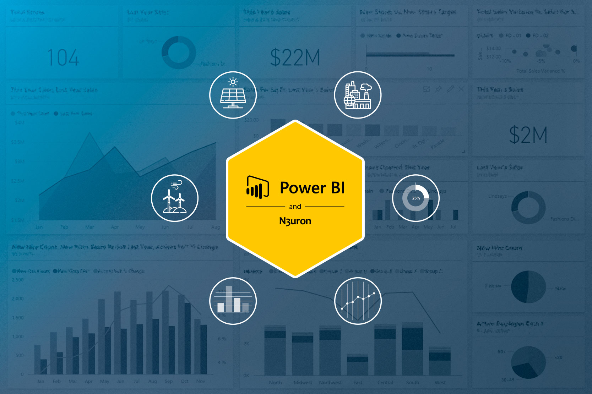

# PBI-Dashboard


# 📊 Power BI — Guía Completa de Business Intelligence

<p align="center">
  
</p>

> Una guía de referencia sobre Microsoft Power BI: qué es, por qué usarlo, cómo se despliega, y ejemplos reales de dashboards.

---

## 📋 Tabla de Contenidos

- [¿Qué es Power BI?](#-qué-es-power-bi)
- [¿Por qué usarlo?](#-por-qué-usarlo)
- [Contexto de uso](#-contexto-de-uso)
- [Usos en las empresas](#-usos-en-las-empresas)
- [Tipos de datos y conectores](#-tipos-de-datos-y-conectores)
- [Modelado y DAX](#-modelado-y-dax)
- [Deployment](#-deployment)
- [Ejemplos de Dashboards](#-ejemplos-de-dashboards)
- [Recursos para aprender](#-recursos-para-aprender)

---

## 🔷 ¿Qué es Power BI?

**Microsoft Power BI** es una suite de herramientas de Business Intelligence que permite conectar datos de múltiples fuentes, transformarlos, modelarlos y presentarlos mediante visualizaciones interactivas y dashboards dinámicos.

### Componentes principales

| Componente | Descripción |
|---|---|
| **Power BI Desktop** | Aplicación de escritorio para crear informes y modelos de datos |
| **Power BI Service** | Plataforma en la nube (`app.powerbi.com`) para publicar, compartir y colaborar |
| **Power BI Mobile** | App móvil (iOS / Android) para consumir informes en cualquier lugar |
| **Power BI Report Builder** | Para informes paginados de alta precisión |
| **Power BI Embedded** | Para integrar visualizaciones en aplicaciones externas |
| **Power BI Gateway** | Para conectar datos on-premise con el servicio en la nube |

---

## ✅ ¿Por qué usarlo?

### 🚀 Velocidad de implementación
Permite crear dashboards funcionales en horas, no meses. Su interfaz drag-and-drop y los conectores predefinidos reducen significativamente la curva de aprendizaje.

### 💰 Relación costo-beneficio
Con un modelo de licenciamiento accesible (desde versión gratuita hasta planes empresariales Premium), Power BI ofrece capacidades avanzadas a una fracción del costo de sus competidores.

### 🔗 Integración con Microsoft 365
Si la organización ya usa Excel, Teams, SharePoint o Azure, la integración es nativa y sin fricciones.

### 🧠 Inteligencia Artificial integrada
- **Q&A** — Consultas en lenguaje natural
- **Smart Narratives** — Texto generado automáticamente que describe los datos
- **Anomaly Detection** — Detección automática de anomalías en series de tiempo
- **Key Influencers** — Identificación de factores que impactan una métrica

### Comparativa con competidores

| Criterio | Power BI | Tableau | Qlik |
|---|:---:|:---:|:---:|
| Facilidad de uso | ⭐⭐⭐⭐⭐ | ⭐⭐⭐⭐ | ⭐⭐⭐ |
| Integración Microsoft | ⭐⭐⭐⭐⭐ | ⭐⭐⭐ | ⭐⭐⭐ |
| Costo entry level | $10/user/mes | $15/user/mes | $20/user/mes |
| Capacidades IA | ⭐⭐⭐⭐⭐ | ⭐⭐⭐⭐ | ⭐⭐⭐⭐ |
| Versión gratuita | ✅ Sí | ⚠️ Limitada | ⚠️ Limitada |

---

## 🎯 Contexto de uso

Power BI es la solución indicada cuando:

- 📁 La información está dispersa en múltiples fuentes (ERP, CRM, Excel, APIs)
- 📈 La dirección necesita KPIs sin depender del área de TI para cada reporte
- 🔄 Se generan reportes periódicos manuales que pueden automatizarse
- 🏭 Se requiere monitoreo operativo en tiempo real

### Niveles de madurez analítica

```
Nivel 1 → Descriptivo:   ¿Qué pasó?        → Dashboards históricos, KPIs
Nivel 2 → Diagnóstico:   ¿Por qué pasó?    → Drill-down, análisis de causa raíz
Nivel 3 → Predictivo:    ¿Qué pasará?      → Integración con ML (Azure ML, Python, R)
Nivel 4 → Prescriptivo:  ¿Qué debo hacer?  → IA integrada, recomendaciones automáticas
```

---

## 🏢 Usos en las empresas

### 💵 Finanzas y Contabilidad
- Dashboards de P&L (Pérdidas y Ganancias)
- Seguimiento de flujo de caja y presupuesto vs. real
- Análisis de varianzas y proyecciones financieras
- Reportes de cierre mensual automatizados

### 📣 Ventas y Marketing
- Seguimiento de pipeline y forecast de ventas
- Análisis de conversión por canal, región y vendedor
- ROI de campañas de marketing
- Segmentación de clientes (RFM, cohortes)

### 👥 Recursos Humanos
- Indicadores de rotación y ausentismo
- Análisis de estructura salarial
- Seguimiento de desempeño y objetivos
- Diversidad e inclusión

### ⚙️ Operaciones y Supply Chain
- Monitoreo de producción y eficiencia (OEE)
- Control de inventarios y punto de reorden
- Tracking de entregas y SLA logístico
- Gestión de calidad y defectos

### 💻 Tecnología / IT
- Gestión de tickets y tiempos de resolución
- Control de proyectos ágiles (Azure DevOps)
- Análisis de seguridad y cumplimiento
- Seguimiento de deuda técnica

### 📞 Atención al Cliente
- Volumen de llamadas y tiempos de espera
- CSAT, NPS y satisfacción del cliente
- Seguimiento de SLAs y productividad de agentes

---

## 🗄️ Tipos de datos y conectores

Power BI ofrece más de **150 conectores nativos**, agrupados en:

| Categoría | Ejemplos |
|---|---|
| **Bases de datos** | SQL Server, PostgreSQL, MySQL, Oracle, BigQuery, Snowflake |
| **Archivos** | Excel, CSV, JSON, XML, PDF, Parquet |
| **Servicios en la nube** | Azure, Google Analytics, Salesforce, SharePoint, OneDrive |
| **APIs y web** | REST APIs, OData, Web scraping |
| **Plataformas BI** | SSAS, Azure Analysis Services, Dataverse |

### Modos de conectividad

| Modo | Descripción | Ideal para |
|---|---|---|
| **Import** | Datos copiados al modelo | Datasets < 1 GB, alta performance |
| **DirectQuery** | Consultas en tiempo real | Datos grandes, actualización continua |
| **Live Connection** | Conexión directa a SSAS/AAS | Modelos corporativos centralizados |
| **Composite Models** | Combinación Import + DirectQuery | Escenarios híbridos |
| **Streaming** | Datos en tiempo real | IoT, monitoreo operativo |

---

## 🧮 Modelado y DAX

### Esquema en estrella (Star Schema)

La base de un buen modelo en Power BI:

```
                    ┌─────────────────┐
                    │   DIM_Fecha     │
                    └────────┬────────┘
                             │
┌──────────────┐    ┌────────┴────────┐    ┌──────────────┐
│ DIM_Cliente  ├────┤  FACT_Ventas    ├────┤ DIM_Producto │
└──────────────┘    └────────┬────────┘    └──────────────┘
                             │
                    ┌────────┴────────┐
                    │  DIM_Region     │
                    └─────────────────┘
```

### Ejemplos de fórmulas DAX esenciales

```dax
-- Medida básica
Total Ventas = SUM(FACT_Ventas[Monto])

-- Ventas del año anterior (YoY)
Ventas Año Anterior =
CALCULATE(
    [Total Ventas],
    SAMEPERIODLASTYEAR(DIM_Fecha[Fecha])
)

-- Crecimiento porcentual
% Crecimiento YoY =
DIVIDE(
    [Total Ventas] - [Ventas Año Anterior],
    [Ventas Año Anterior],
    0
)

-- Acumulado del año (YTD)
Ventas YTD =
TOTALYTD([Total Ventas], DIM_Fecha[Fecha])

-- Ranking de productos
Ranking Producto =
RANKX(
    ALL(DIM_Producto[Nombre]),
    [Total Ventas],
    ,
    DESC
)

-- % del total
% del Total =
DIVIDE(
    [Total Ventas],
    CALCULATE([Total Ventas], ALL(DIM_Producto))
)
```

---

## 🚢 Deployment

### Ciclo de vida de un reporte

```
Desarrollo (Desktop) → Publicación (Service) → Distribución (Apps)
       ↑                                               ↓
   Actualización                             Usuarios finales
```

### Deployment Pipelines (Entornos)

Power BI Premium y Microsoft Fabric incluyen pipelines con tres etapas:

```
[ Development ] ──► [ Test / Staging ] ──► [ Production ]
```

### Actualización de datos

| Método | Frecuencia máxima |
|---|---|
| Scheduled Refresh | 8x/día (Pro) · 48x/día (Premium) |
| Incremental Refresh | Solo datos nuevos/modificados |
| DirectQuery | Tiempo real continuo |
| Streaming Dataset | Push vía API en tiempo real |
| On-Demand Refresh | A demanda (manual o Power Automate) |

### Row Level Security (RLS)

```dax
-- Cada usuario ve solo los datos de su región
[Region] = USERPRINCIPALNAME()
```

### Microsoft Fabric

La evolución de Power BI es **Microsoft Fabric** (2023), una plataforma unificada que integra:
- Data Engineering (Spark, Delta Lake)
- Data Warehouse (Synapse)
- Data Science (notebooks, ML)
- Real-Time Analytics (KQL)
- Power BI (visualización)

Todo sobre un único lago de datos: **OneLake**.

---

## 📸 Ejemplos de Dashboards

### Call Center Analytical Dashboard

<p align="center">
  
</p>

> Dashboard de análisis operativo de Call Center. Consolida KPIs críticos: **32.94K llamadas recibidas**, **824K minutos** de duración total y un **CSAT promedio de 5.5**. Incluye segmentación geográfica, análisis de sentimientos, distribución por canal y cumplimiento de SLA.

---

### Internet Sales Dashboard

<p align="center">
  
</p>

> Dashboard de e-commerce con ventas totales de **$28.42M**, costos de **$16.72M** y cobertura global. Visualiza la evolución 2017–2020, distribución por tipo de promoción y desempeño por categoría de producto (Bikes, Accessories, Clothing).

---

### Defects Analysis Dashboard

<p align="center">
  
</p>

> Dashboard de calidad de software: **90 defectos** totales, **40% de defect leakage** y **97% de defectos válidos en producción**. Incluye tendencias mensuales, Lead Time vs Cycle Time y distribución por entorno (Development, Production, SIT).

---

### Digiformer Trend Analysis

<p align="center">
  
</p>

> Dashboard de monitoreo de sensores industriales (Power Xpert Meter 2000) en Houston, TX. Presenta un heatmap de lecturas por hora/día, estadísticas descriptivas (min, max, promedio, desviación estándar) y una línea de tendencia temporal continua.

---

## 📚 Recursos para aprender

### Documentación oficial

| Recurso | Descripción |
|---|---|
| [Microsoft Learn — Power BI](https://learn.microsoft.com/es-es/power-bi/) | Documentación oficial + rutas de aprendizaje gratuitas |
| [Power BI Blog](https://powerbi.microsoft.com/es-es/blog/) | Novedades y actualizaciones mensuales |
| [Power BI Community](https://community.powerbi.com/) | Foro oficial con millones de posts |
| [Power BI Ideas](https://ideas.powerbi.com/) | Vota y propone nuevas funcionalidades |
| [Microsoft Fabric Updates](https://fabricupdates.microsoft.com/) | Roadmap actualizado |

### Cursos y certificaciones

| Recurso | Plataforma | Nivel |
|---|---|---|
| **PL-300: Power BI Data Analyst** | Microsoft / Pearson VUE | Intermedio–Avanzado |
| **Power BI A-Z** | Udemy | Principiante |
| **Enterprise DNA** | enterprisedna.co | Intermedio–Avanzado |
| **SQLBI** | sqlbi.com | DAX Avanzado |

### Canales de YouTube recomendados

| Canal | Enfoque |
|---|---|
| 🎥 [Guy in a Cube](https://www.youtube.com/@GuyInACube) | General — actualizado semanalmente |
| 🎥 [SQLBI](https://www.youtube.com/@SQLBI) | DAX y modelado avanzado |
| 🎥 [Enterprise DNA](https://www.youtube.com/@EnterpriseDNA) | Dashboards avanzados |
| 🎥 [Curbal](https://www.youtube.com/@curbal) | DAX y Power Query en español |
| 🎥 [Leila Gharani](https://www.youtube.com/@LeilaGharani) | Power BI + Excel |

### Blogs y comunidades

| Recurso | URL |
|---|---|
| **DAX Patterns** | [daxpatterns.com](https://www.daxpatterns.com/) |
| **Power BI Tips** | [powerbi.tips](https://powerbi.tips/) |
| **Radacad** | [radacad.com](https://radacad.com/) |
| **Reddit r/PowerBI** | [reddit.com/r/PowerBI](https://www.reddit.com/r/PowerBI/) |

### Herramientas complementarias

| Herramienta | Uso |
|---|---|
| [Tabular Editor](https://tabulareditor.com/) | Edición avanzada de modelos DAX |
| [DAX Studio](https://daxstudio.org/) | Análisis y optimización de consultas DAX |
| [Bravo for Power BI](https://bravo.bi/) | Formato, traducción y análisis de modelos |
| [ALM Toolkit](http://alm-toolkit.com/) | Comparación y merge de modelos |

---

<p align="center">
  <i>Hecho con ❤️ | Actualizado 2025</i>
</p>

